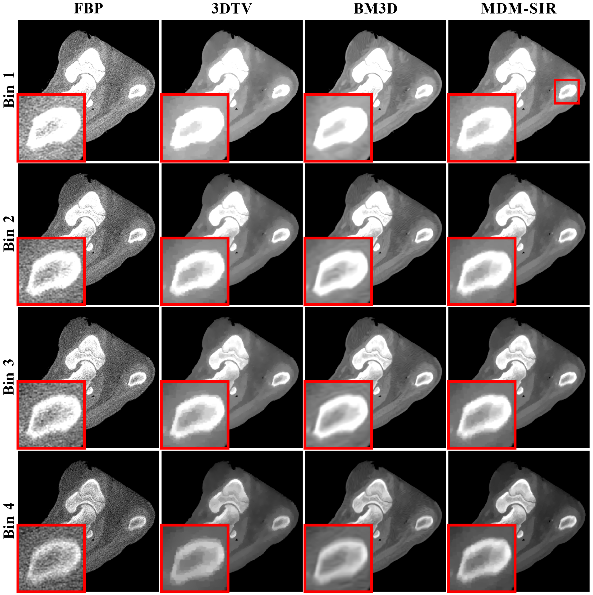

# MDM-SIR (SIR-E3DTV)
This is code of the iterative reconstruction method at the Section III-E in the paper:

@ARTICLE{9115052,
  author={Li, Danyang and Zeng, Dong and Li, Sui and Ge, Yongshuai and Bian, Zhaoying and Huang, Jing and Ma, Jianhua},
  journal={IEEE Transactions on Medical Imaging}, 
  title={MDM-PCCT: Multiple Dynamic Modulations for High-Performance Spectral PCCT Imaging}, 
  year={2020},
  volume={39},
  number={11},
  pages={3630-3642},
  doi={10.1109/TMI.2020.3001616}}

## Requirements

* Linux Platform
* MATLAB
* [IRT](https://web.eecs.umich.edu/~fessler/code/)

## Describe
This model utilize an advanced prior term (enhanced 3DTV, E3DTV) for spectral and photon-counting data reconstruction. To solve the model, we use the alternating direction method of multipliers algorithm (ADMM).

## Results

The following image shows the pig leg results of the compared methods, i.e., FBP, 3DTV, BM3D and the presented MDM-SIR methods, respectively. And zoomed ROIs indicated by the red box illustrate the details of the phantom.

## Contact

If you have any question, please feel free to contact Danyang Li (Email: lidanyang1995@smu.edu.cn or dyli0730@gmail.com).
